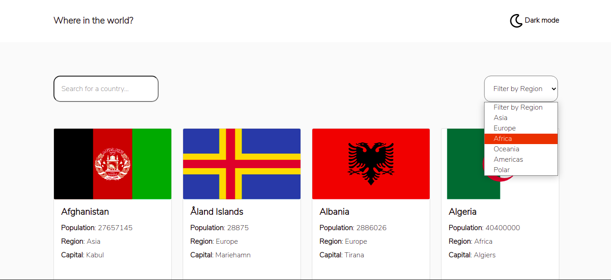

# Frontend Mentor - REST Countries API with color theme switcher solution

This is a solution to the [REST Countries API with color theme switcher challenge on Frontend Mentor](https://www.frontendmentor.io/challenges/rest-countries-api-with-color-theme-switcher-5cacc469fec04111f7b848ca).

## Table of contents

- [Overview](#overview)
  - [The challenge](#the-challenge)
  - [Screenshot](#screenshot)
  - [Links](#links)
- [My process](#my-process)
  - [Built with](#built-with)
  - [What I learned](#what-i-learned)
  - [Scope for improvement](#scope-for-improvement)
- [Author](#author)
- [Appendix](#appendix)

## Overview

### The challenge

The challenge is to integrate with the [REST Countries API](https://restcountries.eu) to pull country data and display it like in the designs.

Users should be able to:

- See all countries from the API on the homepage
- Search for a country using an `input` field
- Filter countries by region
- Click on a country to see more detailed information on a separate page
- Click through to the border countries on the detail page
- Toggle the color scheme between light and dark mode _(optional)_

### Screenshot

### Links

- Solution URL: [Github](https://github.com/winay05/rest-countries-frontend)
- Live Site URL: [Live URL](https://your-live-site-url.com)

## My process

### Built with

- Bootstrap and React-Bootrap for styles
- CSS custom properties
- Flexbox
- CSS Grid
- Mobile-first workflow
- [React](https://reactjs.org/) - JS library
- [Flaticon](https://www.flaticon.com/) - Icon assets

### What I learned

- Quick design and development for an application frontend adhering to given specs.
- Applying and toggling themes in applications using simple JS and CSS.

### Scope for improvement

Application can be improved for optmized use of resources and for making the UX better.

- Loading Spinner.
- Pagination

## Author

- Website - [Vinay Kumar Dahiya](https://vinaykumardahiya-portfolio.netlify.app/)
- Frontend Mentor - [@winay05](https://www.frontendmentor.io/profile/winay05)

## Appendix

This project was bootstrapped with [Create React App](https://github.com/facebook/create-react-app).

### How to run

In the project directory, you can run:

#### `npm start`

Runs the app in the development mode.\
Open [http://localhost:3000](http://localhost:3000) to view it in the browser.

The page will reload if you make edits.\
You will also see any lint errors in the console.

#### `npm run build`

Builds the app for production to the `build` folder.\
It correctly bundles React in production mode and optimizes the build for the best performance.

The build is minified and the filenames include the hashes.\
Your app is ready to be deployed!

See the section about [deployment](https://facebook.github.io/create-react-app/docs/deployment) for more information.
